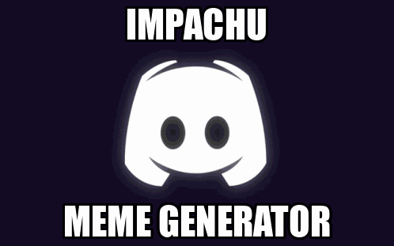

# impachu
Multi-purpose image processing bot for discord.
Current features:
- Robust Meme Maker
- AI Anime Face Generator (courtesy of https://github.com/mchong6/GANsNRoses)

## Discord Channel Usage:

Commands:

  **help** -- show help options
  
   `!help`
     
  **impact** -- create basic impact font meme
  
   `!impact <URL> [top_text] [bottom_text]`

  
   
   **poster** -- create (de)motivational poster meme
   
   `!poster <URL> [top_text] [bottom_text]`

  

   **anime** -- create AI generated anime face from a still image

   `!anime <URL> [seed]`

## Setting the Bot up Yourself

Through this [link](https://discord.com/api/oauth2/authorize?client_id=794697319659732992&permissions=0&scope=bot), you can add the bot to your server and start using the bot with minimal setup.

However, if you want to host the bot on your own server, follow these instructions:


1. Install Python (>= version 3.7)

2. Install required python packages specified in `requirements.txt`

From root directory of repo, run `pip3 install -r requirements.txt`
It is highly recommended to use a clean virtual environment to prevent conflicts with other packages.

3. Install impachu in the local environment

From root directory of repo, run `pip3 install -e .`

4. Point bot to your personal Discord bot application token

Create a file named `.env` in the root directory of repo with the following format:
```
#.env
DISCORD_TOKEN=<Discord Bot Token>
```

Your Discord bot token can be acquired by creating a bot from the [Discord Developer Portal](https://discord.com/developers/applications).

5. Run the bot

To start the bot, call the `run` script located within the `bin` folder.

`./bin/run`

You should now see a message "Impachu has connected to Discord!"